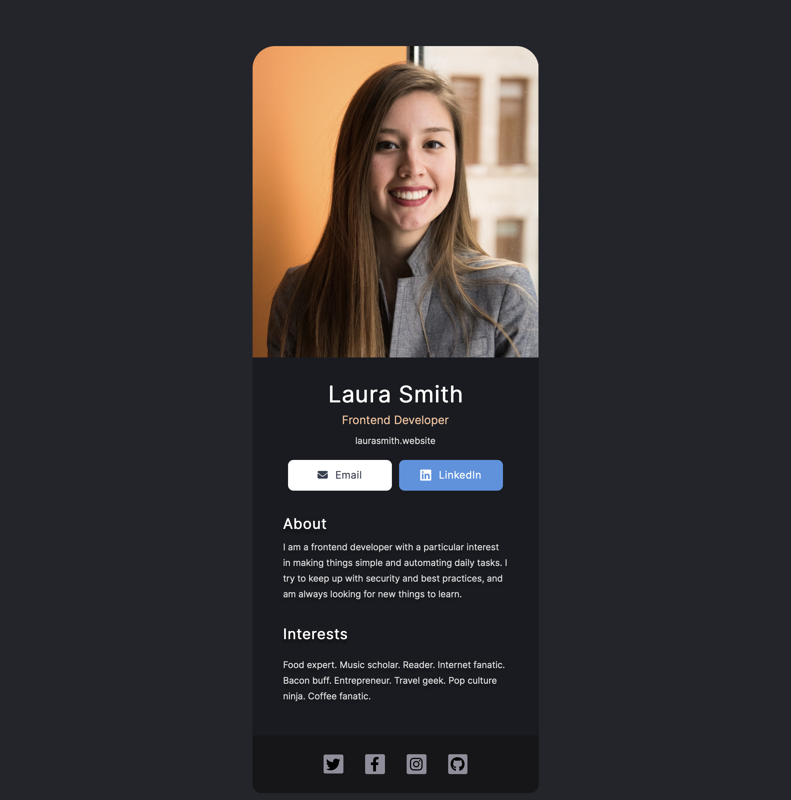

# Solo project 1: Digital Business Card

  This is the first solo project on Scrimba's Learn React course.

  ### Requirements

   - Build from scratch!
   - Separate components for:
     - Info (photo, name, buttons, etc.)
     - About
     - Interests
     - Footer (social icons)

   ### Screenshot

   

   ### Links

   - [Solution Link](https://solo-project1-react.netlify.app)

   ## My process

   ### Built with

   - Semantic HTML5 markup
   - CSS custom properties
   - Flexbox
   - ReactJS